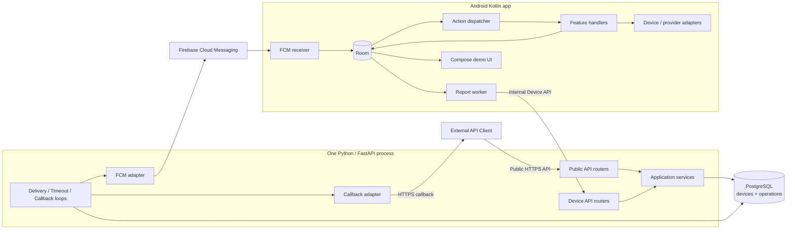
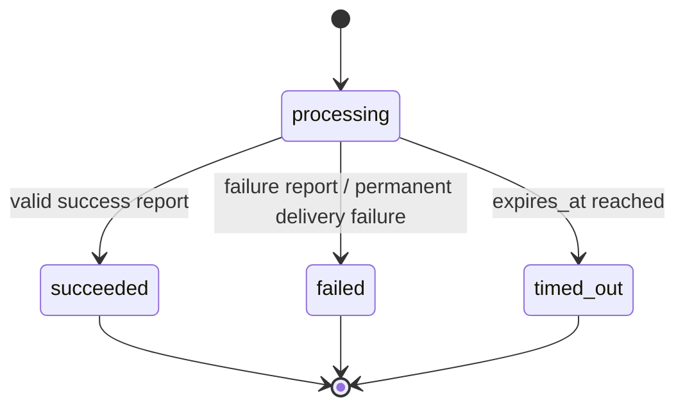
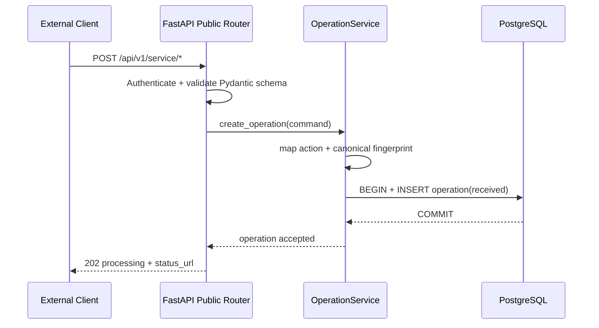
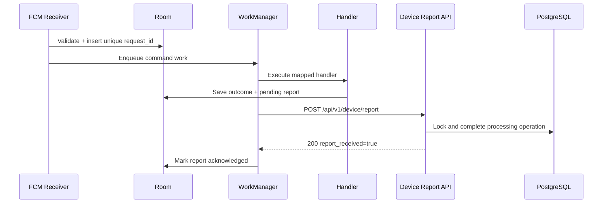

# TECH STACK VÀ KIẾN TRÚC XÂY DỰNG PROTOTYPE

> Implementation blueprint cho App Communication Server và Android demo.  
> Nguồn contract/phạm vi: [`project_context.md`](./project_context.md).  
> Giải thích và lộ trình học: [`architecture_learning_guide.md`](./architecture_learning_guide.md).  
> Trạng thái: sẵn sàng dùng để scaffold và viết code prototype.  
> Cập nhật: 2026-08-02.

## 1. Mục tiêu và phạm vi

### 1.1. Mục tiêu triển khai

- Xây đủ 9 Public function endpoint và Request Status API.
- Nhận request, lưu bền vững, gửi FCM command, nhận device report và trả kết quả cuối.
- Hỗ trợ idempotency, retry, timeout và callback.
- Android demo nhận command, chạy đúng handler và gửi report.
- Fake/sandbox adapter cho phép demo lặp lại được khi provider thật chưa sẵn sàng.
- Code/module đủ rõ để mở rộng sau prototype mà không thay Public API contract.

### 1.2. Phạm vi prototype

- Một Python/FastAPI process chứa HTTP API và background worker loops.
- Một PostgreSQL database với hai bảng nghiệp vụ chính: `devices`, `operations`.
- Một Firebase project demo.
- Một Android app Kotlin, một active device cho mỗi `user_id`.
- Một External API Client demo với bearer token/callback config từ environment seed.
- Docker Compose cho backend và PostgreSQL.

### 1.3. Ngoài phạm vi hiện tại

- Microservices, Redis/Celery/Kafka và nhiều backend replicas.
- HA/DR, autoscaling, production IAM/KMS và admin portal.
- Provider production khi chưa có credential, scope hoặc phê duyệt.
- Public streaming/WebSocket turn-by-turn.
- Thay đổi contract đã định nghĩa trong `project_context.md`.

## 2. Quyết định kiến trúc

| Quyết định | Lựa chọn prototype |
|---|---|
| Backend language | Python 3.13 |
| API | FastAPI + Uvicorn, một worker process |
| Validation/config | Pydantic 2 + `pydantic-settings` |
| Persistence | PostgreSQL + SQLAlchemy 2 async + `asyncpg` |
| Migration | Alembic |
| Background jobs | Python `asyncio` loops polling/claiming `operations` |
| Push | Firebase Admin Python SDK / FCM HTTP v1 |
| Callback client | HTTPX `AsyncClient` |
| Package/tooling | uv, Ruff, mypy, pytest |
| Android | Kotlin + Compose + Room + WorkManager + FCM |
| Delivery semantics | At-least-once + idempotent processing |
| Provider | Interface/adapter; fake implementation mặc định |

Backend, worker, migration, seed, scripts và tests đều dùng Python. Kotlin chỉ dùng cho Android native. SQL/Docker/YAML/Gradle DSL là schema/build/configuration.

## 3. Tech stack

### 3.1. Backend

| Hạng mục | Công nghệ | Quy ước |
|---|---|---|
| Runtime | CPython 3.13 | Pin patch bằng `.python-version` và Docker digest |
| API/ASGI | FastAPI + Uvicorn | Async endpoints; một Uvicorn worker trong prototype |
| Schema | Pydantic 2 | Request/response model tách SQLAlchemy model |
| Config | `pydantic-settings` | Validate/fail-fast khi startup |
| ORM | SQLAlchemy 2 async | Session theo use case/transaction |
| Driver | `asyncpg` | PostgreSQL async driver |
| Migration | Alembic | Không tự tạo/cập nhật schema khi app startup |
| FCM | `firebase-admin` Python SDK | Blocking call chạy bằng bounded `asyncio.to_thread` |
| HTTP callback | HTTPX | Một `AsyncClient` dùng chung trong lifespan |
| Logging | `structlog` + stdlib logging | JSON log + redaction + request correlation |
| Dependency | uv | Commit `pyproject.toml` và `uv.lock` |
| Test | pytest, pytest-asyncio, HTTPX | PostgreSQL thật cho integration test |
| Quality | Ruff + mypy strict | CI fail khi lint/format/type lỗi |

### 3.2. Android

| Hạng mục | Công nghệ |
|---|---|
| Language/UI | Kotlin + Jetpack Compose + Material 3 |
| Background | Firebase Messaging + WorkManager |
| Persistence | Room |
| Network | Retrofit/OkHttp + Kotlinx Serialization |
| Dependency injection | Hilt |
| Config | DataStore |
| Local secrets | Android Keystore |
| Navigation | Google Maps Navigation SDK |
| Music | MusicKit Android qua adapter |
| Test | JUnit, MockK, Turbine, Room/Compose tests |

### 3.3. Hạ tầng

- Docker Compose: PostgreSQL + backend container.
- Android chạy từ Android Studio.
- Firebase project riêng cho demo/staging.
- Không yêu cầu Redis/message broker.
- Public/Internal OpenAPI export thành hai artifact riêng.

## 4. Kiến trúc tổng thể



### 4.1. Backend components

| Component | Trách nhiệm |
|---|---|
| Public API routers | Auth, Pydantic validation, response envelope/OpenAPI |
| Device API routers | Register device, nhận report và auth device |
| Operation service | Idempotency, transaction và public state transition |
| Device service | Register/update/resolve active device |
| Report service | Validate ownership/action/result và complete operation |
| Delivery loop | Claim due operation, gửi FCM, retry/permanent failure |
| Timeout loop | Mark processing operation quá hạn thành `timed_out` |
| Callback loop | Gửi terminal result và retry callback |
| Repositories | SQLAlchemy query/locking, không chứa HTTP/provider logic |
| Adapters | FCM, callback HTTP và field encryption |

### 4.2. Dependency direction

```text
api → service → repository → PostgreSQL
             ↘ adapter → FCM / callback
worker → service / repository / adapter
```

Rules:

- Router không gọi SQLAlchemy/Firebase trực tiếp.
- Repository không quyết định endpoint-to-action hoặc public error.
- Worker không import HTTP router.
- Adapter không tự thay đổi operation state.
- State transition nằm trong application service/repository transaction.

## 5. API và action mapping

Public/Internal API body và response giữ nguyên `project_context.md`.

| Method và path | `operation` / `action` | Timeout mặc định |
|---|---|---:|
| `POST /api/v1/service/ride/quote` | `ride_quote` | 60 giây |
| `POST /api/v1/service/ride/confirm` | `ride_confirm` | 90 giây |
| `POST /api/v1/service/music/play` | `music_play` | 45 giây |
| `POST /api/v1/service/music/stop` | `music_stop` | 30 giây |
| `POST /api/v1/service/music/volume` | `music_volume` | 30 giây |
| `POST /api/v1/service/navigation/start` | `navigation_start` | 90 giây |
| `POST /api/v1/service/navigation/stop` | `navigation_stop` | 45 giây |
| `POST /api/v1/service/emergency/call` | `emergency_call` | 21 phút; demo clock rút ngắn |
| `POST /api/v1/service/contact/call` | `contact_call` | 60 giây |

Additional endpoints:

| Method và path | Scope |
|---|---|
| `GET /api/v1/requests/{request_id}` | Public, operation thuộc authenticated client |
| `POST /api/v1/device/register` | Internal Android |
| `POST /api/v1/device/report` | Internal Android |
| `GET /health/live` | Process liveness |
| `GET /health/ready` | PostgreSQL + worker bootstrap readiness |

Mapping được khai báo bằng Python `Enum`/dictionary cố định và unit test đủ 9 endpoint.

## 6. Data model

### 6.1. `devices`

| Column | Type | Constraint/ý nghĩa |
|---|---|---|
| `id` | UUID | Primary key |
| `user_id` | varchar | Indexed |
| `device_id` | varchar | Unique |
| `platform` | enum | `android` |
| `push_token_ciphertext` | text | Encrypted at rest |
| `push_token_fingerprint` | varchar | Indexed comparison fingerprint |
| `status` | enum | `active`, `inactive`, `revoked` |
| `last_seen_at` | timestamptz | Device resolution |
| `created_at`, `updated_at` | timestamptz | UTC audit |

Device resolver chọn active device có `last_seen_at` mới nhất cho `user_id`.

### 6.2. `operations`

| Nhóm | Columns |
|---|---|
| Identity | `request_id` PK, `client_id`, `user_id` |
| Contract | `operation`, `action`, `params jsonb`, `request_fingerprint` |
| Public state | `request_state`, `result jsonb`, `error jsonb` |
| Delivery | `device_id`, `delivery_state`, `delivery_attempts`, `next_delivery_at`, `delivery_locked_until`, `provider_message_id` |
| Callback | `callback_state`, `callback_attempts`, `next_callback_at`, `callback_locked_until` |
| Report dedup | `report_payload_hash` |
| Timing | `created_at`, `updated_at`, `expires_at`, `completed_at` |

Constraints/indexes:

```text
PRIMARY KEY (request_id)
CHECK request_state IN (processing, succeeded, failed, timed_out)
CHECK delivery_state IN (received, sending, retry, sent, failed, report_received, report_timeout)
CHECK callback_state IN (not_required, pending, sending, retry, delivered, dead_letter)
INDEX (request_state, delivery_state, next_delivery_at)
INDEX (request_state, expires_at)
INDEX (callback_state, next_callback_at)
INDEX (client_id, created_at DESC)
```

Application constraints:

- `result != null` chỉ khi succeeded.
- `error != null` chỉ khi failed/timed_out.
- Terminal state immutable.
- Report phải khớp operation user/device/action.

### 6.3. Retention prototype

- Operations: 30 ngày.
- Inactive push token: 30 ngày.
- Application log: 14 ngày.
- Có script Python reset/seed demo database.

## 7. State machines

### 7.1. Public request



### 7.2. Delivery

```text
received → sending → sent → report_received
              ↘ retry ───↗
              ↘ failed
                       sent → report_timeout
```

### 7.3. Callback

```text
not_required
pending → sending → delivered
             ↘ retry ───↗
             ↘ dead_letter
```

### 7.4. Android command

```text
received → queued → executing → succeeded/failed → report_pending → reported
        ↘ rejected
```

## 8. Processing flows

### 8.1. Accept Public request



Idempotency:

```text
fingerprint = SHA-256(client_id + method + path + canonical_validated_body)
```

- New `request_id`: insert operation.
- Existing ID + same fingerprint: return original operation, no new execution.
- Existing ID + different fingerprint: `409 REQUEST_ID_CONFLICT`.

### 8.2. Delivery

```mermaid
sequenceDiagram
    participant W as Delivery loop
    participant P as PostgreSQL
    participant F as FCM adapter
    participant D as Android

    W->>P: Claim due row; set sending + delivery lease
    P-->>W: operation + device
    W->>F: Send versioned command
    F-->>W: message id / error
    alt FCM accepted
        W->>P: delivery_state=sent
        F-->>D: data message
    else retryable error
        W->>P: retry + next_delivery_at
    else permanent error
        W->>P: delivery failed + request failed
    end
```

Claim transaction commit trước khi gọi FCM. FCM call chạy ngoài DB transaction. Lease hết hạn cho phép phục hồi operation bị kẹt ở `sending`.

Internal command:

```json
{
  "schema_version": 1,
  "request_id": "550e8400-e29b-41d4-a716-446655440008",
  "action": "contact_call",
  "params": { "name": "Nguyễn Văn A" },
  "issued_at": "2026-08-02T10:00:00Z",
  "expires_at": "2026-08-02T10:01:00Z"
}
```

### 8.3. Android execution/report



Report validation:

- Authenticated device matches `user_id` and `device_id`.
- `request_id` exists and belongs to target device/client.
- Report `action` matches operation action.
- `result/error` validates against action schema.
- Duplicate `report_payload_hash` returns `200` without state change.
- Only `processing` operation can become terminal.

### 8.4. Timeout

Timeout loop conditional-updates operations:

```text
WHERE request_state = processing AND expires_at <= now()
SET request_state = timed_out,
    delivery_state = report_timeout,
    error = REPORT_TIMEOUT,
    callback_state = pending
```

Report and timeout race is resolved by row lock/conditional terminal transition; only one transition succeeds.

### 8.5. Callback

- Claim terminal operation with callback `pending/retry` using callback lease.
- POST Request Status representation to configured callback URL.
- Add `Authorization: Bearer <callback_token>`.
- Add `Idempotency-Key: {request_id}`.
- Persist callback outcome/attempt/next retry.
- Callback failure never changes terminal public state.

## 9. Worker design

### 9.1. Lifespan

FastAPI lifespan creates and owns:

- SQLAlchemy async engine/session factory.
- Shared HTTPX `AsyncClient`.
- Firebase Admin app/adapter.
- Shutdown event.
- Delivery, timeout, callback tasks.

Shutdown order:

1. Set shutdown event; stop claiming new work.
2. Wait/cancel managed tasks within grace period.
3. Close HTTPX client.
4. Dispose database engine.

### 9.2. Worker loops

| Loop | Polls | Action |
|---|---|---|
| Delivery | due `received/retry` hoặc expired `sending` lease | Resolve device, send FCM, persist outcome |
| Timeout | processing + expired `expires_at` | Conditional terminal transition |
| Callback | terminal + callback `pending/retry` hoặc expired lease | HTTP callback and persist outcome |

Worker requirements:

- Poll interval, batch size và lease duration configurable.
- Claim bằng `SELECT ... FOR UPDATE SKIP LOCKED`.
- Không giữ DB transaction trong network call.
- Catch/log error per item; một lỗi không dừng loop.
- Respect task cancellation.
- At-least-once; all consumers idempotent.

### 9.3. Delivery retry policy

| Error class | Policy |
|---|---|
| Network timeout / FCM unavailable | Retry with jitter |
| Quota/rate limit | Retry using provider hint when available |
| Invalid/unregistered token | Deactivate device token; permanent failure |
| Device not found/inactive | Permanent `TARGET_UNAVAILABLE` |
| FCM accepted/no report | Wait until operation timeout |

Default demo attempts: immediate, +5 seconds, +20 seconds; maximum 3 sends.

### 9.4. Callback retry policy

- Success: HTTP `2xx`.
- Retry: network error, `408`, `429`, `5xx`.
- Permanent: other `4xx`.
- Backoff demo: immediate, 10 seconds, 1 minute, 5 minutes, 30 minutes.
- Connect timeout 3 seconds; total timeout 10 seconds.

## 10. Android architecture

### 10.1. Packages

```text
android/app/src/main/java/.../
├── api/              Device register + report client
├── command/          FCM receiver + dispatcher + workers
├── data/             Room + DataStore + repositories
├── feature/          Ride/music/navigation/emergency/contact handlers
├── provider/         Fake and real adapters
├── permissions/      Permission state and UX
└── ui/               Compose screens
```

Prototype starts with one Gradle app module. Package boundaries above must be preserved.

### 10.2. Room tables

`commands`:

- Unique `request_id`.
- `schema_version`, action, params.
- Execution state/attempt timestamps.
- Result/error.

`pending_reports`:

- `request_id`.
- Serialized report payload/hash.
- Attempt count and next retry.
- Acknowledgement state.

Room transaction rules:

- Insert/deduplicate command before enqueue.
- Only non-terminal command enters `executing`.
- Persist outcome + pending report atomically.
- Mark report acknowledged only after server HTTP 200.

### 10.3. Action dispatcher

Dispatcher map is compile-time/tested:

```kotlin
interface ActionHandler<P : CommandParams, R : CommandResult> {
    val action: Action
    suspend fun execute(params: P): HandlerOutcome<R>
}
```

FCM command và local demo button phải gọi cùng handler.

### 10.4. Adapter matrix

| Port | Prototype implementation | Optional real implementation |
|---|---|---|
| `RideAdapter` | Deterministic fake | Uber sandbox/API/SDK |
| `MusicCatalogAdapter` | Local fake catalog | Apple Music API |
| `MediaPlaybackAdapter` | Fake playback state | MusicKit Android |
| `NavigationAdapter` | Simulated session | Google Navigation SDK walking |
| `LocationAdapter` | Fixed coordinates | Fused Location Provider |
| `ContactAdapter` | Seeded contacts | ContactsContract/picker |
| `CallAdapter` | Simulated / `ACTION_DIAL` | `ACTION_CALL` when allowed |
| `MessageAdapter` | Simulated / SMS Intent | Direct SMS when allowed |

### 10.5. Background constraints

- FCM receiver only validates, persists, shows notification and schedules work.
- Long navigation uses appropriate foreground flow/service.
- Commands requiring user interaction become pending-user-action.
- Test Doze, notification permission, process death, force-stop and lost network.
- FCM delivery is not guaranteed when user force-stops app until app is reopened.

## 11. Source structure

```text
app_demo_backend/
├── apps/
│   ├── backend/
│   │   ├── src/app/
│   │   │   ├── main.py
│   │   │   ├── config.py
│   │   │   ├── database.py
│   │   │   ├── lifespan.py
│   │   │   ├── api/
│   │   │   │   ├── public.py
│   │   │   │   ├── device.py
│   │   │   │   └── health.py
│   │   │   ├── schemas/
│   │   │   │   ├── common.py
│   │   │   │   ├── service_requests.py
│   │   │   │   └── device.py
│   │   │   ├── models/
│   │   │   │   ├── operation.py
│   │   │   │   └── device.py
│   │   │   ├── repositories/
│   │   │   │   ├── operations.py
│   │   │   │   └── devices.py
│   │   │   ├── services/
│   │   │   │   ├── operation_service.py
│   │   │   │   ├── device_service.py
│   │   │   │   └── report_service.py
│   │   │   ├── workers/
│   │   │   │   ├── runner.py
│   │   │   │   ├── delivery.py
│   │   │   │   ├── timeout.py
│   │   │   │   └── callback.py
│   │   │   └── adapters/
│   │   │       ├── fcm.py
│   │   │       ├── callback.py
│   │   │       └── crypto.py
│   │   ├── alembic/
│   │   ├── tests/
│   │   ├── pyproject.toml
│   │   ├── uv.lock
│   │   └── .python-version
│   └── android/
│       ├── app/
│       └── gradle/
├── contracts/
│   ├── public-api.openapi.yaml
│   └── device-api.openapi.yaml
├── infra/
│   └── compose.yaml
├── docs/
│   ├── demo-script.md
│   └── troubleshooting.md
├── architeture.md
├── architecture_learning_guide.md
├── project_context.md
└── README.md
```

Backend start command:

```text
uv run uvicorn app.main:app --app-dir apps/backend/src --host 0.0.0.0 --port 8000
```

## 12. Configuration

### 12.1. Backend

| Variable | Required | Purpose |
|---|---|---|
| `APP_ENV` | Yes | `local`, `test`, `demo` |
| `HTTP_PORT` | Yes | FastAPI port |
| `DATABASE_URL` | Yes | PostgreSQL async DSN |
| `PUBLIC_API_TOKEN_HASH` | Yes | Demo client token hash |
| `DEVICE_API_TOKEN_HASH` | Yes | Android device token hash |
| `FIELD_ENCRYPTION_KEY` | Yes | Encrypt FCM token stored in prototype DB |
| `FCM_PROJECT_ID` | When FCM mode | Firebase project ID |
| `GOOGLE_APPLICATION_CREDENTIALS` | Local FCM | Service account file outside repository |
| `DELIVERY_TRANSPORT` | Yes | `fake` or `fcm` |
| `WORKER_POLL_SECONDS` | No | Default `0.5` |
| `WORKER_BATCH_SIZE` | No | Default `20` |
| `DELIVERY_LEASE_SECONDS` | No | Default `30` |
| `CALLBACK_LEASE_SECONDS` | No | Default `30` |
| `CALLBACK_URL` | When callback enabled | Demo client callback URL |
| `CALLBACK_TOKEN` | When callback enabled | Callback bearer token |
| `CALLBACK_ALLOWED_HOSTS` | When callback enabled | Explicit SSRF allow-list |
| `DEMO_TIME_SCALE` | Demo only | Shorten emergency flow |
| `LOG_LEVEL` | No | `debug` local, `info` demo |

Config validation runs before database/worker startup. Secret values must not be committed.

### 12.2. Android

- Backend base URL per build type.
- Firebase config per environment.
- Demo `user_id`, `device_id` and enrollment token.
- Provider mode per feature: `fake`, `sandbox`, `real`.
- Google Maps API key via Secrets Gradle Plugin.
- No production credential/unrestricted key in source control.

## 13. Error, security and observability

### 13.1. Public error envelope

Stable synchronous codes:

```text
INVALID_REQUEST
UNAUTHORIZED
FORBIDDEN
REQUEST_NOT_FOUND
REQUEST_ID_CONFLICT
INTERNAL_ERROR
TARGET_UNAVAILABLE
```

Async result/error codes follow each action contract in `project_context.md`. No stack trace, raw provider response or internal delivery state in Public API.

### 13.2. Authentication

- Opaque bearer tokens with at least 256-bit entropy.
- Compare keyed hash/HMAC in constant time.
- Public principal: configured `client_id` and scopes.
- Status API verifies operation ownership by `client_id`.
- Device register/report verifies token, `user_id` and `device_id`.
- Revoked device cannot register/report.

### 13.3. Callback security

- Production/staging URL must use HTTPS.
- Prototype callback host must be explicit allow-list.
- Reject loopback/link-local/private targets outside allow-list.
- Set connect/total timeout.
- Redact callback URL query, Authorization and response body.

### 13.4. Command validation

Android validates:

- Supported `schema_version`.
- UUID `request_id`.
- Action allow-list.
- `issued_at`/`expires_at`.
- Params schema for action.

Command must not contain provider credential or bearer token. Ed25519 signing is a post-prototype security extension when required by threat model.

### 13.5. Structured logs

Allowed fields:

```text
timestamp, level, environment, request_id, client_id,
device_id_hash, operation, action, public_state,
delivery_state, callback_state, attempt, duration_ms,
outcome, stable_error_code
```

Redact:

```text
bearer/FCM/callback token, provider credential,
phone number, contact name, exact location
```

### 13.6. Minimum metrics

- HTTP count/latency/error by route template.
- Operation count by action/state.
- Accepted-to-FCM and accepted-to-terminal duration.
- Delivery retry/permanent failure/invalid token.
- Pending/retry operation count and oldest age.
- Callback success/retry/dead-letter.
- DB pool usage and query error.

Metric labels must not contain raw request/user/device IDs.

## 14. OpenAPI and contract management

- FastAPI routers use Pydantic request/response models.
- Export `contracts/public-api.openapi.yaml` from Public routers only.
- Export `contracts/device-api.openapi.yaml` from Internal Device routers only.
- Contract examples and error codes are sourced from `project_context.md`.
- CI compares exported specs with committed files.
- Breaking Public API change requires versioning/ADR; prototype implementation must not silently change response envelope.
- Android DTOs can be generated from Internal spec or implemented manually with contract tests; choose one approach consistently.

## 15. Testing and acceptance

### 15.1. Backend tests

| Test layer | Required coverage |
|---|---|
| Unit | Mapping, fingerprint, state transition, retry classification, timeout, redaction |
| PostgreSQL integration | Migration, unique ID, claim/lease, recovery, report-timeout race |
| API | Auth, Pydantic validation, response envelope, ownership, register/report |
| Worker | Fake FCM/callback success, retry and permanent failure |
| Contract | All request/result/error examples for 9 actions |
| E2E | Request → delivery → report → status/callback |

PostgreSQL locking/JSONB tests must use PostgreSQL, not SQLite.

### 15.2. Android tests

- Duplicate FCM creates one Room command/execution.
- Dispatcher covers all 9 actions and rejects unknown action.
- Fake handlers conform to result/error schemas.
- Process death does not lose pending report.
- WorkManager retries report.
- Permission denied and user cancellation map to stable errors.
- Compose Overview, Command Detail, Logs and feature screens render state correctly.

### 15.3. Mandatory E2E scenarios

1. Success: request → FCM → fake handler → report → succeeded → callback.
2. Idempotent duplicate returns original operation and no second execution.
3. Conflicting request ID returns `409`.
4. Device unavailable returns known failure.
5. No report reaches `timed_out`.
6. FCM transient failure retries and succeeds.
7. Callback `500` then `200` retries without changing operation state.
8. Backend restart recovers due/leased operation.
9. Android restart sends pending report without re-executing handler.
10. Report from wrong device/action is rejected.

### 15.4. Functional demo matrix

| Feature | Prototype acceptance |
|---|---|
| Ride quote | `quote_id`, price, ETA, expiry |
| Ride confirm/cancel | `requested` or `cancelled` using quote ID |
| Music play | Track + `playing` + volume |
| Music stop/volume | `stopped` / changed level |
| Navigation start/stop | `navigation_id`, `navigating`, then `stopped` |
| Contact call | One match success; zero/multiple known errors |
| Emergency | Scaled demo cycle with required result fields |

Fake adapters use deterministic seed/scenario configuration.

## 16. Implementation plan

### Phase P0 — Contracts and scaffold

- Create uv Python project and Android project.
- Create Public/Internal Pydantic schemas and OpenAPI exports.
- Add Ruff, mypy, pytest and CI commands.
- Docker Compose PostgreSQL.

### Phase P1 — Database and API foundation

- SQLAlchemy models and Alembic migration for two tables.
- Config, logging, health endpoints.
- Bearer auth and request ownership.
- Operation service, idempotency and Status API.
- Implement `music_volume` as first vertical slice.

### Phase P2 — Worker pipeline

- Delivery claim/lease/recovery.
- Fake delivery and FCM adapters.
- Timeout worker.
- Callback worker.
- Concurrency/restart tests.

### Phase P3 — Android pipeline

- Compose shell and device register.
- FCM receiver, Room commands/pending reports.
- WorkManager dispatcher/report retry.
- One fake handler E2E.

### Phase P4 — Complete feature contracts

- Add remaining 8 actions.
- Add deterministic fake adapters.
- Add feature screens and Command Detail/Logs.
- Complete contract and E2E matrix.

### Phase P5 — Selected real adapters and demo hardening

- Real FCM on physical device.
- Android location/volume/contact/call intent.
- Navigation/MusicKit/Uber sandbox only when credentials/approval exist.
- Seed/reset scripts, demo script and troubleshooting guide.
- Rehearsal with Doze/process restart/network failure.

## 17. Definition of Done

- 9 function endpoints validate contract and persist before `202`.
- Status API/callback expose the same terminal representation.
- One real FCM command reaches Android in supported background state.
- Android fake mode executes all 9 actions through production dispatcher path.
- Duplicate request/message/report does not cause duplicate handler execution.
- Restart backend/Android does not lose due operation or pending report.
- Timeout, retry, permanent failure and callback dead-letter are observable.
- Report ownership/action/result validation is enforced.
- Public/Internal OpenAPI are separate and pass contract tests.
- No secrets or sensitive raw data in repository/logs.
- Fresh-machine setup, seed/reset and demo instructions are documented.
- Provider fake/sandbox/real mode is visible; prototype does not claim unavailable production integration.

## 18. Post-prototype extension boundaries

The current package/data boundaries allow these upgrades without changing Public API:

- Run API and worker as separate Python processes.
- Add transactional outbox + Celery/Redis.
- Normalize delivery/callback attempt tables.
- Add client/credential/callback configuration tables.
- Add OAuth2/IAM, device attestation and KMS.
- Add OpenTelemetry/Prometheus dashboards.
- Run multiple replicas with managed PostgreSQL HA.

Upgrade triggers, reasons and exercises are documented in [`architecture_learning_guide.md`](./architecture_learning_guide.md#11-lộ-trình-nâng-cấp-có-tín-hiệu).

## 19. Platform/provider constraints

### 19.1. FCM/Android background

- High-priority message must be time-sensitive/user-visible.
- Receiver only persists/notifies/schedules work.
- Doze, force-stop, OEM battery policy and notification permission affect delivery.

### 19.2. Google Navigation

- Navigation SDK 7.x baseline uses `minSdk 24`, `targetSdk 36` and Google Play services.
- Walking mode is supported.
- Terms, disclaimer, attribution and API-key restriction are required.

### 19.3. Uber/MusicKit

- Uber production ride request may require OAuth privileged/full access.
- MusicKit Android requires developer configuration, developer token and active user subscription.
- Provider private key/token must not be embedded in APK.

### 19.4. Call/SMS/contacts

- Runtime permission and Android background restriction apply.
- Direct SMS/call/contact access may require Google Play declarations/roles/exceptions.
- Internal demo APK and Play-distributed build require separate policy assessment.

## 20. Technical references

- [Python downloads/releases](https://www.python.org/downloads/)
- [FastAPI type hints/OpenAPI](https://fastapi.tiangolo.com/python-types/)
- [SQLAlchemy asyncio](https://docs.sqlalchemy.org/en/20/orm/extensions/asyncio.html)
- [Alembic](https://alembic.sqlalchemy.org/)
- [uv projects](https://docs.astral.sh/uv/guides/projects/)
- [Firebase Admin SDK setup](https://firebase.google.com/docs/admin/setup)
- [FCM Android message priority](https://firebase.google.com/docs/cloud-messaging/android/message-priority)
- [Android architecture recommendations](https://developer.android.com/topic/architecture/recommendations)
- [Android background restrictions](https://developer.android.com/develop/background-work/background-tasks/bg-work-restrictions)
- [Navigation SDK requirements](https://developers.google.com/maps/documentation/navigation/android-sdk/setup-overview)
- [Navigation travel modes](https://developers.google.com/maps/documentation/navigation/android-sdk/reference/com/google/android/libraries/navigation/RoutingOptions.TravelMode)
- [MusicKit Android overview](https://developer.apple.com/documentation/technologyoverviews/audio-and-music)
- [Uber Ride Requests](https://developer.uber.com/docs/riders/ride-requests/introduction)
- [Google Play SMS/Call Log policy](https://support.google.com/googleplay/android-developer/answer/10208820)
